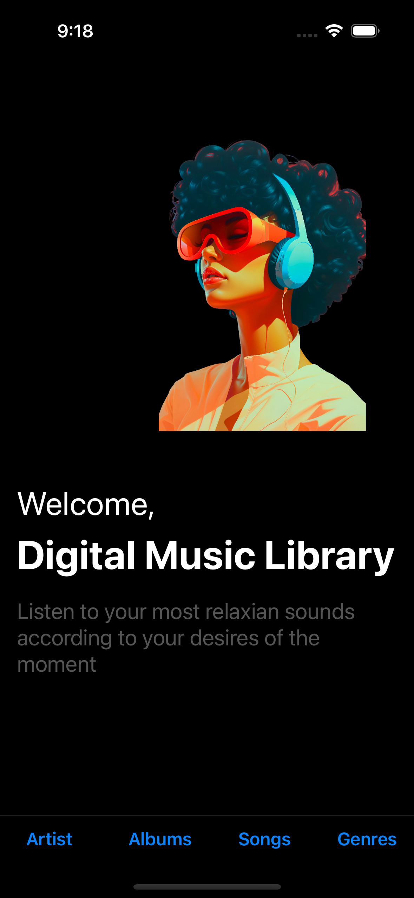
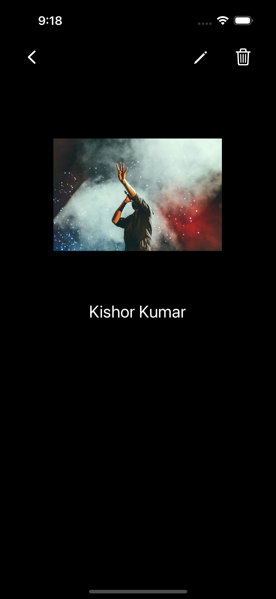
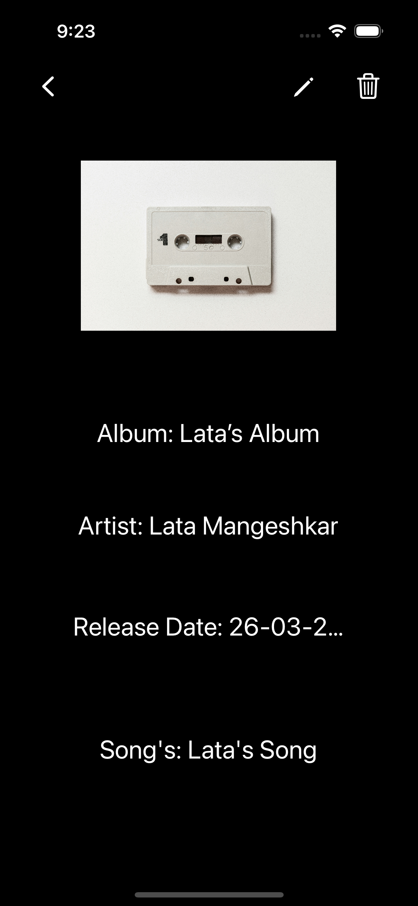
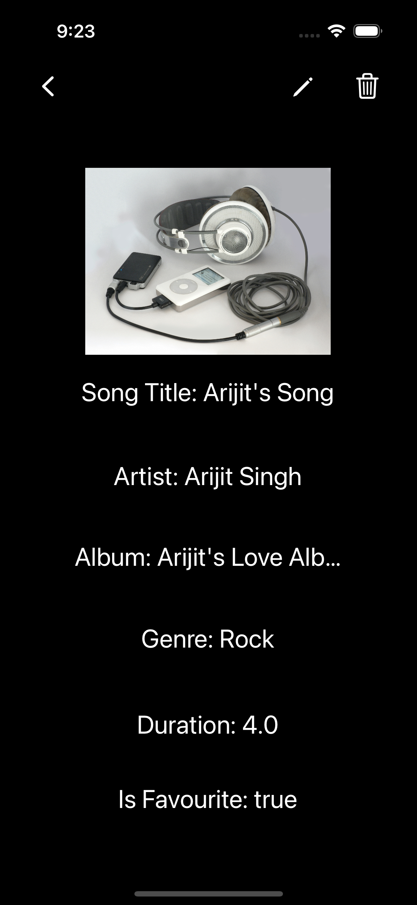
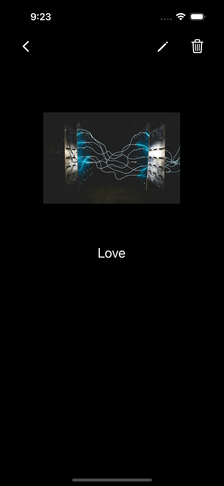

# Music Library App

## Overview

The Digital Music Library app is a Music Library. It allows users to add, edit, delete artist, albums, songs and genres.

## Features

- **Browse**: Browse through your music library effortlessly.
- **Search**: Find your favorite artists, albums, songs, and genres quickly.
- **Organize**: Create playlists, organize your music by artist, album, genre, etc.
- **Discover**: Discover new music through recommendations and curated playlists.

## Screenshots

### Artist

### Album

### Songs

### Genre

